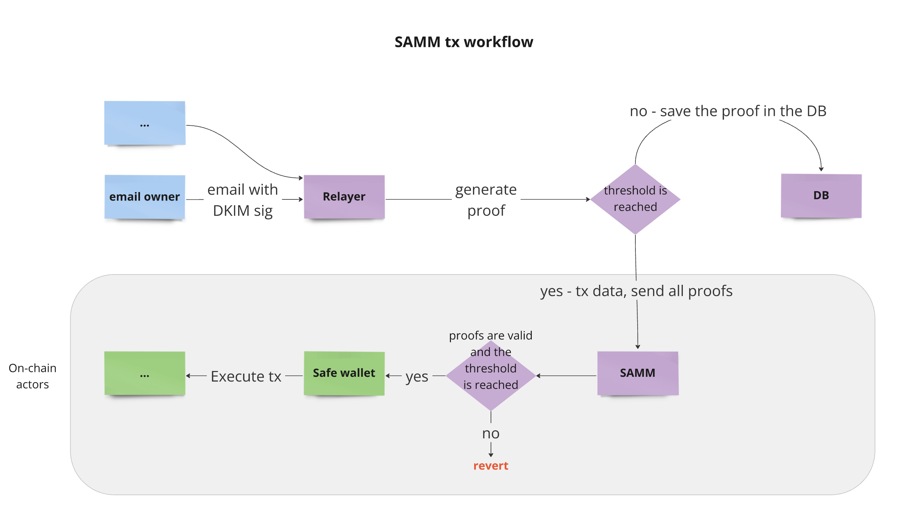

# Safe Anonymization Mail Module (SAMM)

## Description

This is an implementation of the PoC contract for the [NCR#1](https://github.com/orgs/noir-lang/discussions/5932) grant.

Our key concept is centered around the creation of a module for Safe multisig that ensures the anonymity of all its participants using ZK-SNARK technology and Noir language.

The details are described in:

- [Proposal](https://github.com/orgs/noir-lang/discussions/5813#discussioncomment-10450949)

## Workflow

1. **Owners of Safe wallet**

   Safe multisig has a standard set of EOA owners who can manage the multisig without restrictions, including managing the rights of the SAMM module.

   The SAMM module has restrictions on what actions it can perform on behalf of the multisig (security policies). These restrictions are implemented and verified in the smart contract code. For example, the SAMM module cannot change the owners of the Safe multisig or can only call specific smart contracts. 
   
   Thus, the SAMM module is used to conveniently manage routine operations, while the standard set of EOA owners is used to handle critically important tasks.

   

2. **Connecting the Module to Safe**

   A Merkle tree is used to store the email addresses of the owners of the SAMM module.

   Our module incorporates a proxy pattern, deployed through the SAMM Factory.

   To link a module to Safe, Safe must invoke `enableModule`, passing the address of the created proxy as an argument.

   

3. **Executing the Transaction**

   A transaction can only be executed once the proof threshold is met.

   

## Requirements

- Foundry

## Installation

To get started with this project, you need to install Foundry. Follow the instructions [here](https://book.getfoundry.sh/getting-started/installation).

```bash
git clone https://github.com/oxor-io/sam-contracts.git
cd sam-contracts
foundryup
forge install
```

## Testing

Before running tests, you will need to set up an `.env` file in the project root with an Ethereum API key. Create a `.env` file and add the following:

```
MAINNET_RPC={your-ethereum-api-key}
```

Replace `your-ethereum-api-key` with your actual API key. Then, you can run tests with the following command:

```bash
forge test
```

## Proof generation

For detailed instructions on how to generate a proof, refer to the repository with [circuit](https://github.com/oxor-io/sam-circuits).

## Disclaimer

The code provided in this repository has not undergone a security audit. It is provided "as is" and without any warranty.

## License

This project is licensed under the GNU General Public License v3.0 - see the [LICENSE](LICENSE) file for details.
